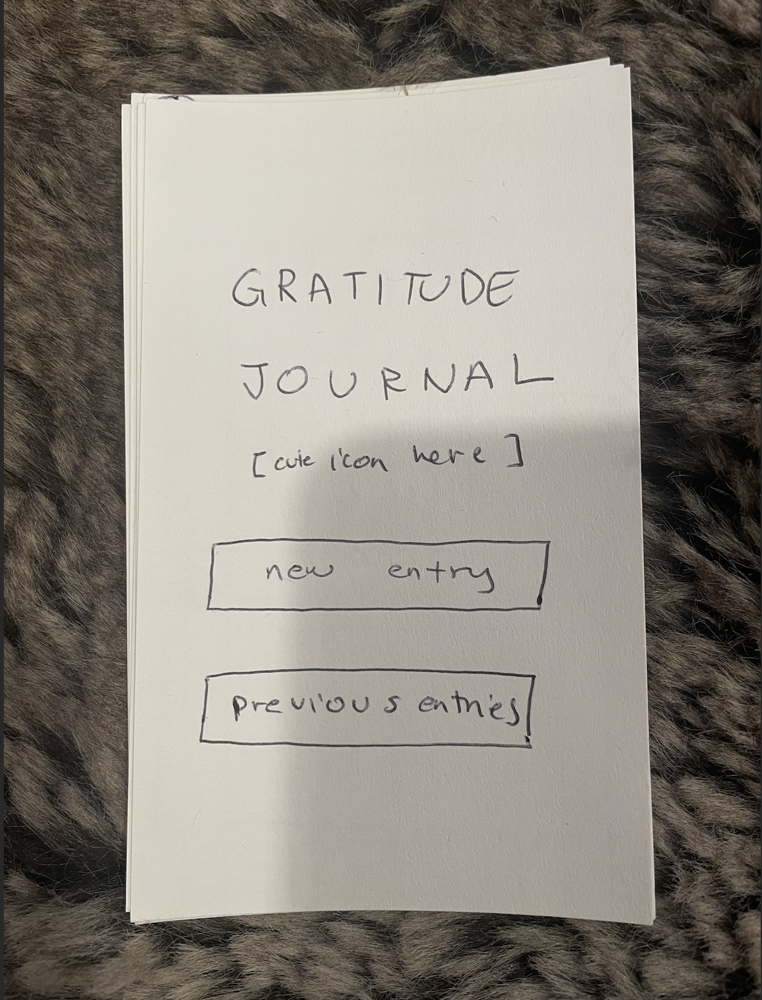
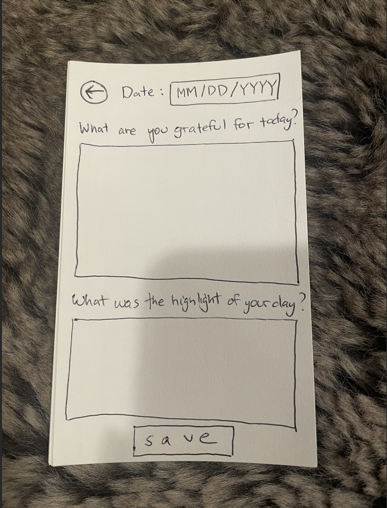
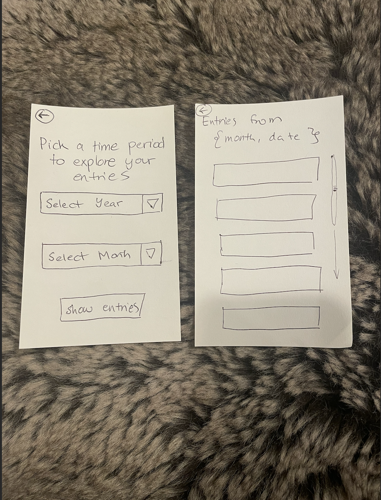

# Food Finder

## Student Information
Name: Jasper Balinas

CSE netid: jbalinas

email: jbalinas@cs.washington.edu

## Design Vision
Tell us about what your design vision was.
 - Functionally
    I wanted users to be able to reflect on what they were grateful for that day, as well as what the best part (the highlight!) of their day was

    

 - Aesthetically
    I wanted a simple and cute UI to make the app feel like an easy resting place for the user's eyes and thoughts, without much to look at.

    I wanted a home screen with simple navigation to a new entry or previous entries. 

    

 - Data
    Initially I wanted the data to be organized by month and year so users wouldn't have to scroll endlessly for old entries (assuming that in the future, everything wouldn't disappear when I close my emulator), but then I realized I could do something like that maybe for the second part depending on wht the complexity is going to look like.

    

**Where in your repo can we find the design sketches that you made?**

Above, and in the assets folder!

**If your final design changed from your initial sketches please explain what changed and why.**

To be honest, I ran out of time this week playing catch up, and opted for something similar but much simpler. For what it's worth, I'm all caught up now!

## Resources Used
Cite anything (website or other resource) or anyone that assisted you in creating your solution to this assignment.

Remember to include all online resources (other than information learned in lecture or section and android documentation) such as Stack Overflow, other blogs, students in this class, or TAs and instructors who helped you during Office Hours. If you did not use any such resources, please state so explicitly.

https://www.youtube.com/watch?v=Q96CK-GkbGM
https://api.flutter.dev/flutter/material/TextField-class.html
https://api.flutter.dev/flutter/material/TextFormField-class.html
https://api.flutter.dev/flutter/widgets/TextEditingController-class.html

## Reflection Prompts

### Constructor Design in Journal Entry

**'JournalEntry', our default constructor**
Factory constructor for creating a new journal entry with optional text. Handles generation of a unique ID, sets creation/update timestamps to current time. Covers most common use case, creating a new entry.

**'JournalEntry.withTextUUIDUpdatedAtCreatedAt', our full constructor**
Allows for specifying all properties more explicitly. Can use it to restore entries from a database where fields are already known.

**'JournalEntry.withUpdatedText', our update constructor**
Can be used to create a modified entry based on existing entry. Keeps the original UUID and timestamp for original entry, making sure that they remain intact even if there are updates.

### Why Copying the List Is Sufficient
Each JournalEntry object is immutable. When the list of entries is copied (eg using List.from), references to the immutable JournalEntry objects are being copied, not the objects themselves. Ths maintains entry integrity, so we don't have to worry about mods to the actual data entries that we don't want. We can add/remove entries from the OG list without affecting the copied list because they are separate instances.

### Stuff Ben Asked Us To Think About
**What capabilities does the ensemble of Journal, JournalEntry, and UUIDMaker give us?**
Gives us a way to manage our collection of entries in a way where the entries we add in are all uniquely identifiable and immutable. We can also keep track of changes to the journal and reversing changes via new versions instead of modding the existing version.

**If we wanted to (from the user's point of view) edit a JournalEntry, how could we do that with these classes, even though JournalEntry is immutable?**
To edit a JournalEntry, you'd want to create a new instance of a JournalEntry with the changes you want, then use upsertEntry so the existing entry with the same UUID is replaced.

**Have you seen this pattern before or is it new to you?**
Yes, with commits to Git! And I guess VC systems in general, but Git is the one I am most familiar with.

### Provider Reflections
**How else could we have implemented JournalProvider and Journal to give the same consistency guarantees as we have but without the proxy and clone structure we implemented here?**
Could make Journal into a ChangeNotifier so it could notify our listeners when we make modifications so we wouldn't need a provider to manage it for us.

**What are the pros/cons of this way vs. what you come up with?**
Our proxy/clone implementation preserves Journal from direct modifications and makes it so that we can control how changes happen. However, cloning objects like this might slow the app down.

Journal --> ChangeNotifier implementation would make things more simple since we'd be reducing our components and handling state management in one spot as opposed to having a separate provider class. But! Since it ties the data model to the UI, it could make it more difficult to test in isolation as well as making the data model less reusable as opposed to having cloned objects.

### Changing Time/Date Formatting
Sometimes I don't read thoroughly enough and I didn't realize there was a method at the bottom until I had already played with how I wanted my time/date to be formatted, so I just deleted the existing method since it was already fine.

### New Learnings
What new tools, techniques, or other skills did you learn while doing this assignment? How do you think you might use what you learned in the future?

I learned how to use TextEditingController/TextField/TextFormField! I was thinking about how to make my cards prettier for entry since I've done something similar with JavaScript before. I think this could be useful for making nice authentication widgets in the future.

## Challenges
What was hard about doing this assignment?
What did you learn from working through those challenges?
How could the assignment be improved for future years?

Honestly, now that I have a better handle on Flutter, this really wasn't that bad. I do have to say though, I did have to try extra hard to find all of the questions that we were expected to reflect on scattered throughout the spec. I think it might be helpful to, at the end of the spec, just have a list of required reflection answers just so nobody accidentally misses things -- esp students who have trouble focusing or reading long documents. Accessibility, right?

### Mistakes
What is one mistake that you made or misunderstanding that you had while you were completing this assignment? What is something that you learned or will change in the future as a result of this mistake or misunderstanding?

I was stuck for a couple hours trying to figure out why every time I made a new entry, I would get two entries logged in my home screen. One was empty, one was filled out with the prompt responses. If I edited the empty one, I had three entries logged even though I technically only filled out two. The reason behind this was that my saving logic was triggered both before and after editing the entry without proper checks to prevent duplication. I changed some of my verbiage for my variables ('newEntry' to 'updatedEntry') and wrote explicitly what checks I was making so I could read my code aloud to myself and understand how the data was moving. I think talking out loud to myself helps a lot instead of staying in my head when I am stuck on faulty logic.

### Meta
How much time (in minutes or hours of active work) did you spend working on this assignment? What parts took the longest?
What could we do to make this assignment better in the future?

I worked on this assignment for about 8 hours, including reading the spec, reading documentation, searching for documentation and example videos, writing functional code, writing UI code, writing in answers for reflections, and adding in accessibility components. The parts that took the longest were checking for little things that I missed here and there -- Would've been cool to have a checklist of things (reflection questions) at the end to wrap things up.

## Part 2

### Robustness
**Given how we have implemented this, what are the circumstances under which a user could lose their journal data? What could you do to change the design and implementation of your app to mitigate this risk?**

Some scenarios for potentially losing journal data:
* Uninstaling the app, or somehow otherwise clearing the app's data (and therefore losing the original encryption key since we need that to decode the encrypted data)
* Data corruption from bugs in the app, hardware failure, or other things could make the data useless

Some potential mitigation strategies:
* Make (ideally automatic) backups a thing, either manually exporting it or putting it into cloud storage
* Create systems for recovering a lost encryption key (user authentication, perhaps)

### Reflection

It was fun learning about encryption for Flutter. It wasn't too difficult to pick up since I have a general understanding of what needs to happen from taking a security class, but I am curious about looking more into Hive and seeing how reasonable it would be to incorporate it into the projects I create for fun.

This assignment -- for the most part -- felt properly guided while leaving me enough room to learn through reading documentation, which I thought was very important for me as someone still very green to Flutter, all the more any fellow students who also haven't touched at all on security yet. I appreciated the clear (read: separated in its own little paragraph as opposed to being introduced nested in an already-dense paragraph) links to documentation, and repeated hyperlinks when referenced again later, such as how the EncryptedBox documentation was.

For me, I would say the hardest part of this assignment was understanding what was expected in terms of accessibility apart from "we expect your app to be accessible, make sure it is". That felt brief and curt. When I think about how to enhance accessibility regarding security, I think there are ways to enhance the UI, such as creating clear, accessible interfaces for data backup/restore with audio descriptions to assist users through the process. However, that seemed a little beyond "above and beyond" for this assignment. Since most of the security operations we implemented here happen in the background (eg encrption), I was honestly stumped on how to make these background processes more accessible in the existing very simple application I made.

### Self Grade
I would give myself at least an 85. I don't prescribe to the idea that full marks only belong to above and beyond work (as seen with a number of instructors in the department) -- if you complete what is being asked of you, that should be full marks. I think I completed almost everything this assignment asked of me, but I am usnsure if I was able achieve what was expected for part 4 considering I didn't make changes from Part 1 (no feedback has been given yet on it).
